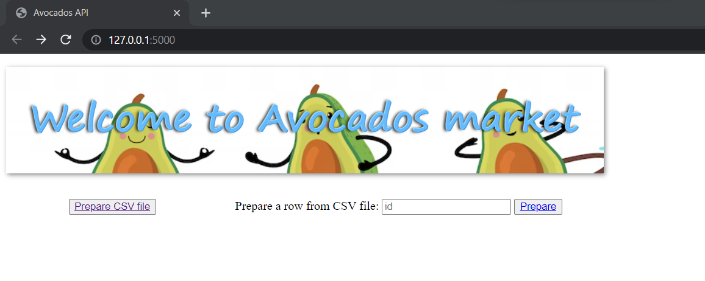
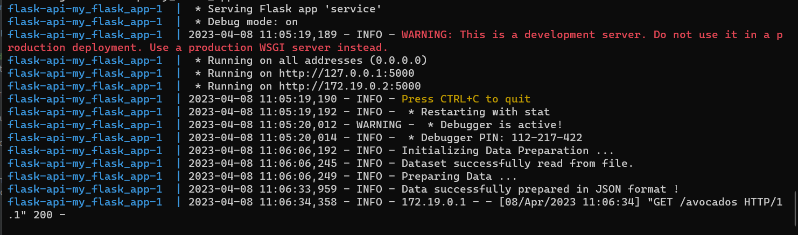
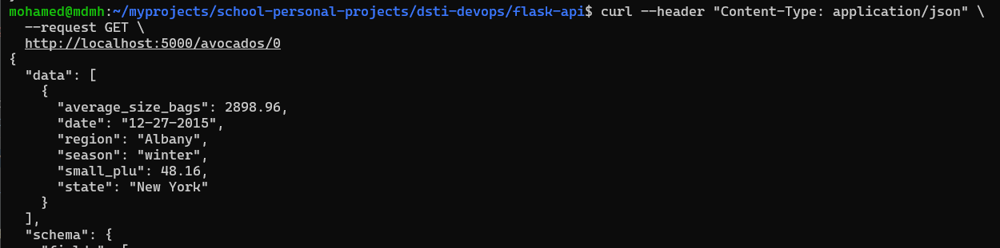

# Flask API web application

It is a Flask web application exposing REST API that uses a custom Python module, to transform a CSV file or a Dataframe from raw avocados data to prepared and accurate JSON output. 

Prepared data are also stored in [ database](https://redis.io/).

## Functionality

1. Start the web application (interactive HTML page)
2. Prepare a CSV file
3. Prepare a single row from the CSV file


## Usage

This application uses Flask REST API and a *** database, it is dockerized.

1. Start the web application

From the root directory of the project run:
```
docker-compose up
```

It will start a web server available in your browser at http://localhost:5000.


2. Prepare a CSV file
The file to prepare is in 'datastets' directory, it is a mounted docker volume.

Click on 'Prepare CSV file', or

Send a GET (REST protocol) request using terminal from the root directory of the project:

```bash
curl --header "Content-Type: application/json" \
  --request GET \
  http://localhost:5000/avocados
```

You can check the logs while data is prepared


It will output a JSON file.


3. Prepare a single row from the CSV file
Input the row number and click 'Prepare', or

Send a GET (REST protocol) request using terminal from the root directory of the project:
replace <index> by the row number you want to prepare
```bash
curl --header "Content-Type: application/json" \
  --request GET \
  http://localhost:5000/avocados/<index>
```

It will output a JSON file with one element.



Another way to test your REST API is to use [Postman](https://www.postman.com/).

## Testing

From the root directory of the project, run:

```
pytest tests/ 
```

## Author

Mohamed Hamiche
m.hamiche99@gmail.com
