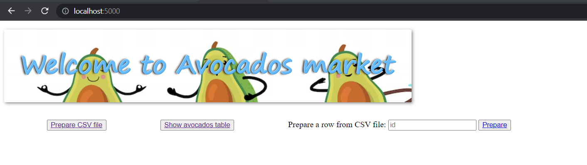
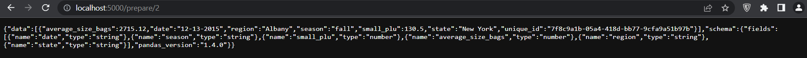

# Flask API web application

It is a Flask web application exposing REST API that uses custom Python packages, to transform a CSV file or a Dataframe from raw avocados data to prepared and accurate JSON output. 

Prepared data are also stored in [MongoDB database](https://www.mongodb.com/).

## Functionality

1. Launch the application 
2. Prepare a CSV file
3. Prepare a single row from the CSV file (metadata should be added to csv file in order to synchronize with database)
4. CRUD operations on the database, multiple endpoints (see service.py)


## Usage

This application uses Flask REST API and a MongoDB database, it is dockerized.
After cloning the repository:

1. Launch the application: 

From the root directory of the project, run:
```
docker-compose up
```


It will start a web server available in your browser at http://localhost:5000 and a mongodb instance initialised with user credentials provided in .env file.


2. Prepare a CSV file

The file to prepare is in 'datastets' directory, it is a mounted docker volume.

Click on 'Prepare CSV file', or

Send a GET (REST protocol) request using terminal from the root directory of the project:

```bash
curl --header "Content-Type: application/json" \
  --request GET \
  http://localhost:5000/avocados
```

You can check the logs while data is prepared


It will output a JSON file, and insert the document to mongodb.


3. Prepare a single row from the CSV file

Input the row number and click 'Prepare', or

Send a GET (REST protocol) request using terminal from the root directory of the project:

replace <index> by the row number you want to prepare
```bash
curl --header "Content-Type: application/json" \
  --request GET \
  http://localhost:5000/avocados/<index>
```

It will output a JSON file with one element, and insert a new line to mongodb or (todo) update the line if existing, a preparation step should be added (affect a unique id to each row of the dataset, which will be the same in the database).



4. Example of other operations: Retrieve all avocados data stored on MongoDB

Click on Show avocados table, or send a GET request:


Another way to test your REST API is to use [Postman](https://www.postman.com/).

## Testing

Run tests of different levels (unit tests, intgration tests): 

```
pytest flask-api/tests/ 
```

The test: test_db.py will be run on the deployed test database on the cloud, if you want to run the tests on the local image of mongodb:

remove the comment to the affectation of uri variable in connector fixture


## Authors

Mohamed Hamiche
Desplan Rudy
